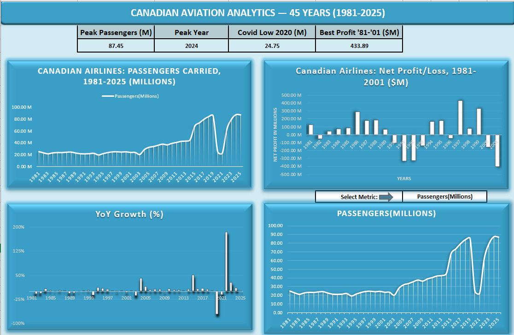

📊 Data Analytics Portfolio — Muhammad Khurram Jassal

Data Analyst | Excel · SQL · Power BI · Python  
📍 Canada | 🎓 MS in Data Science (in progress)  
🔗 www.linkedin.com/in/muhammad-khurram-jassal | 📧 khurramjassal@yahoo.com

👋 About Me

I'm a data analyst building a portfolio of real-world analytics projects across aviation, operations, and customer experience. I work with real datasets from Statistics Canada, US Department of Transportation, and Kaggle to produce professional, insight-driven dashboards.
Currently completing an intensive analytics training program covering Excel, Power BI, Python, and SQL — targeting a data analyst role in the Canadian aviation industry or any data-driven organization.

🗂️ Portfolio Projects

 📁 Project 1 — Canadian Aviation Analytics (1981–2025)
**Tool:** Microsoft Excel | **Data:** Statistics Canada (official government data)
[Project 1-Screenshot](Screenshots/Project1_Canadian_Airlines_2019-2024.png)

**What I built:**
- Reshaped 4,669 rows of long-format government data into a clean analysis table
- Built calculated metrics: Revenue per Passenger, Net Profit/Loss, Year-over-Year growth
- Created an interactive dropdown dashboard — one chart adapts to show any metric
- Produced a 6-finding Data Quality Report documenting financial data gaps and methodology breaks

**Key Insights:**
- Canadian airline passengers grew from 24.8M (1981) → 87.4M peak (2024)
- COVID-19 caused a 71% collapse in 2020 (85.5M → 24.7M passengers)
- Full recovery achieved by 2024 — a new 43-year record
- Worst year was 2001 (9/11 impact, −$401M net loss)

📁 Project 2 — US Flight Delays Q1 2019
**Tool:** Microsoft Excel | **Data:** Kaggle (US DOT) — filtered from 6.5M rows to 1M

**What I built:**
- Extracted a focused 1,007,213-row subset from a 1.3GB raw dataset
- Built 6 PivotTable analyses (carrier, month, day, time of day, plane age, cross-tab)
- Created a modern card-based interactive dashboard with sidebar and slicers
- Produced a Data Quality Report validating all 26 columns across 1M+ rows

**Key Insights:**
- Delta Air Lines is the most reliable carrier (14.2% delay rate vs 18.6% average)
- Delays cascade through the day: 6 AM = 6% delayed, 7 PM = 27% delayed — fly early!
- February is the worst month; Thursday is the worst day to fly
- Plane age is NOT a meaningful predictor of delays

📁 Project 3 — Global Passenger Satisfaction Analytics
**Tool:** Microsoft Excel | **Data:** Kaggle airline satisfaction survey (103,904 reviews)
[Project 3-Screenshot](Screenshots/Project3_Aviation_Passenger_Satisfaction.png)

**What I built:**
- Cleaned and validated 103,904 passenger reviews across 24 variables
- Ranked all 14 service dimensions by average rating to find the airline's weakest areas
- Built a light-themed interactive dashboard with consistent color logic and slicers

**Key Insights:**
- Only 43.3% of passengers are satisfied — more than half are unhappy
- Massive class divide: Business class = 69.4% satisfied, Economy = 18.6%
- Personal/leisure travelers are deeply unhappy: only 10.2% satisfied
- Weakest services: WiFi (2.73/5) and Online Booking (2.76/5)
- Delays barely affect satisfaction — service quality is the real driver

## 🛠️ Tools & Skills

| Category | Skills |
|---|---|
| **Data Analysis** | Excel (Advanced), SQL, PivotTables, Data Cleaning |
| **Visualization** | Excel Dashboards, Power BI (in progress) |
| **Programming** | Python — Pandas, Matplotlib (in progress) |
| **Methods** | Data Quality Reporting, Exploratory Analysis, Business Storytelling |
| **Data Sources** | Statistics Canada, Kaggle, US DOT, Government Open Data |

## 📈 Currently Learning

- **Power BI** — DAX, data modeling, interactive reports
- **Python** — Pandas, NumPy, Matplotlib, Seaborn
- **SQL** — Refreshing and applying to real airline data projects
- **Google Data Analytics Certificate** — in progress

## 📬 Get In Touch

Actively looking for **data analyst opportunities** in Canada — open to part-time, junior, or entry-level roles.

- 🔗 LinkedIn: www.linkedin.com/in/muhammad-khurram-jassal
- 📧 Email: khurramjassal@yahoo.com
- 📍 Location: Toronto, Canada

